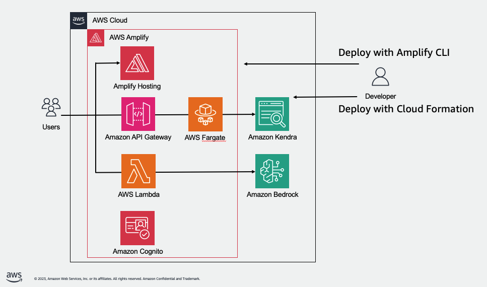
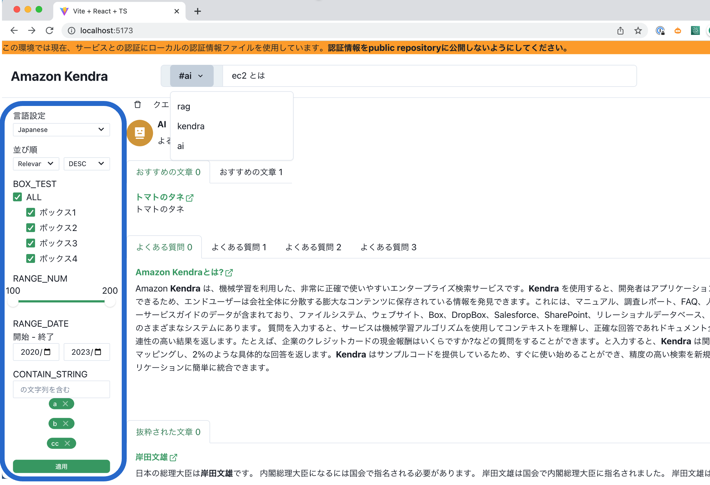
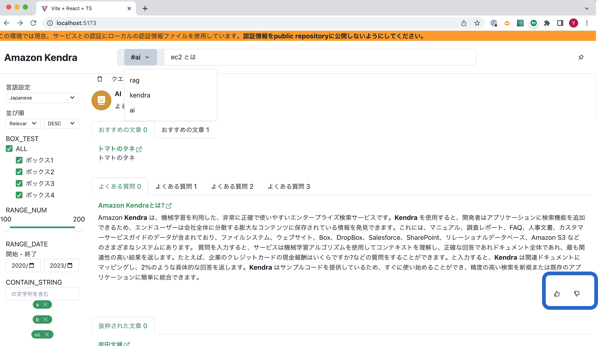
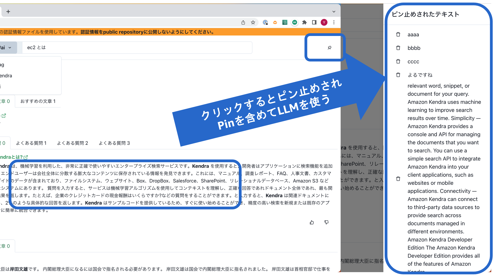
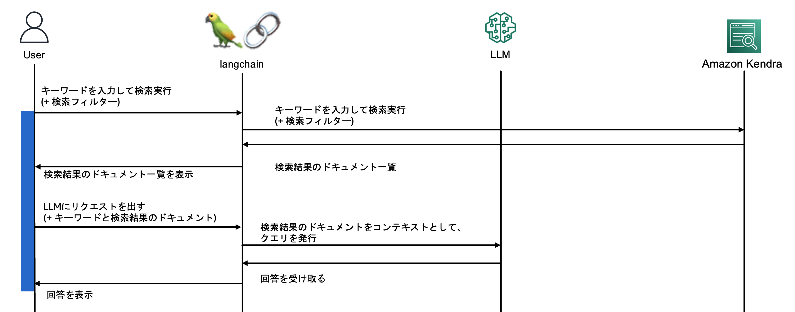
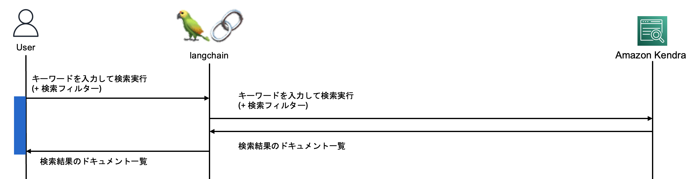
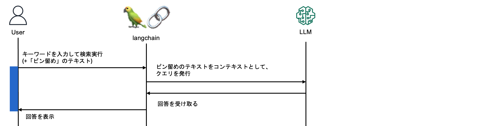

# JP RAG SOLUTION

このソリューションは AWS 上で Retrieval Augmented Generation (RAG) を構築するサンプルコードです。
Retrieval Augmented Generation(RAG)とは、ユーザーのリクエストに最も関連する情報を企業のナレッジベースまたはコンテンツから取得し、それをコンテキストとして束ね、LLM に送信して GenAI レスポンス を返すソリューションのことを指します。

## Architecture Overview / 全体の構成図

このソリューションは以下のような構成になっています。

## Point / 特徴

### ハルシネーション (誤った発言) が抑えられる

会話型(チャットボット型）の GenAI アプリケーションの場合、回答の生成を過去の学習データに依存していることもあり、ハルシネーション (誤った発言)が発生するケースが度々あります。一方で本ソリューションは、コンテンツ検索結果のドキュメントの範囲に回答を限定することでモデルのハルシネーション (誤った発言) を軽減することができます。そして、その場合に重要になる コンテンツ検索機能 については、Amazon Kendra を利用することでエンタープライズレベルの RAGソリューションを実現しています。

### コンテンツ検索で Kendra を利用

本ソリュリューションの１つめの特徴としては、コンテンツ検索 に Amazon Kendraのインテリジェント検索 を利用している点が挙げられます。Amazon Kendra は完全マネージド型のサービスで、すぐに使えるセマンティック検索機能により、ドキュメントや文章の最先端のランキングを行うことができます。Amazon Kendra の高精度検索を使用して、最も関連性の高いコンテンツやドキュメントを取り出すことが可能です。

また、RAGを実現させる場合の困難なポイントとして、多種多様なドキュメントを取り込み、それをインデックス化し、かつそのドキュメントへのアクセスコントロールも実現させる必要があるという点があげられますが、Amazon Kendra を利用することでマネージドで実現させることが可能です。Amazon Kendra には、Amazon Simple Storage Service (Amazon S3)、SharePoint、Confluence、ウェブサイトなどの一般的なデータソースへのコネクタがあらかじめ組み込まれており、HTML、Word、PowerPoint、PDF、Excel、テキストファイルなどの一般的なドキュメント形式もサポートしています。エンドユーザーの権限で許可されているドキュメントのみに基づいて応答をフィルタリングするために、アクセス制御リスト (ACL) にも対応しています。

### LLM は２つから選択可能

本ソリューションは日本語を利用するお客様を想定し、日本語に対応しているLLMの利用を前提としています。デフォルトでは、Rinna 社が開発したモデル [rinna/japanese-gpt-neox-3.6b-instruction-ppo](https://huggingface.co/rinna/japanese-gpt-neox-3.6b-instruction-ppo) か、 Anthropic 社の claude をご利用いただくことが可能です。

なお、ご利用の仕方として、rinnaについては Amazon Sagemaker で エンドポイントを立ててご利用いただくことを想定しております。Endrpointを立ち上げるための [script](llm/deploy_llm.sh) もご用意あります。
一方、claude については、Anthropic社が提供するAPI経由での利用を想定しております。そのため、claude をご希望の場合、事前に (API KEYの取得)[https://www.anthropic.com/]をお願い致します

### ３つの検索モードを提供

本ソリューションは、RAGを提供するのは勿論ですが、Kendra単体での検索や、LLM単体でのQ&A用途でもご利用いただけるように工夫をしているのが特徴となります。

| モード     | 機能                                     | 特徴                          |
|:--------|:---------------------------------------|:----------------------------|
| #rag    | Kendraで検索した文章をコンテキストとして、LLMで回答を生成するモード |                             |
| #kendra | kendraでキーワドに関連する文書検索を行うモード             |                             |
| #ai     | LLMでキーワードに関連する回答を生成するモード               | 「ピン留め」機能により、明示的にコンテキストを指定可能 |

#### Ragモード(#rag)

キーワードをもとに、Amazon Kendra でドキュメントの検索を行い、その検索結果のドキュメントをコンテキストとした上で、LLMにクエリを投げてレスポンスを表示するモードです。
こちらでは、結果として「LLMの回答」「Kendraの検索結果」の２つが出力されます。なお、検索実行から終了までの体感速度を上げる工夫として、Kendraの検索結果をそのままLLMに投げるのではなく、検索結果を画面に一度表示をしてから、LLMに投げるという二段構えを採用しています。

#### Kendraモード(#kendra)

キーワードをもとに、Amazon Kendra でドキュメントの検索を行い、その検索結果のドキュメントを一覧で表示するモードです。
こちらでは、結果として「Kendraの検索結果」が出力されます。

#### AIモード(#ai)

キーワードをもとに、LLM に対してクエリを投げて、そのレスポンスを表示するモードです。なお、本RAGソリューションでは、過去の検索結果を「ピン止めして記録しておく」機能があるのですが、AIモードで検索を行う際には、「ピン留め」したテキストを、クエリのコンテキストに含めて検索することが可能となります。つまり、「ピン留め」はLangChainのメモリのような役割を行います。

### その他の特徴

#### (1) Filterを設定して再検索が可能

Amazon Kendra でのドキュメント検索のフィルター条件を指定することが可能です。
画面の左サイドバーにフィルター条件が並んでいます。

<!--  -->

#### (2) Incremental Learning(英語)

英語のドキュメントに限定されますが、増分学習が可能です。検索結果の各ドキュメントの左下に表示される Goodボタン、Badボタン を押すことで、次回以降の検索結果に反映されます。

<!--  -->

#### (3) 明示的にcontextを指定しLLMのみを使用 (AIモードのみ)

AIモードの場合、ピン留めしたテキストをコンテキストとして含んでクエリを投げることが可能です。
それにより、コンテキスト情報を前提とした回答を生成することが可能です。

<!--  -->

## Search Flow / 検索の流れ

#### Ragモード(#rag)

#### Kendraモード(#kendra)

#### AIモード(#ai)

## Preview / 動作イメージ

## デプロイ/開発

[開発者ガイド](./docs/DeveloperGuide.md) をご参照ください。

## コスト

|               リソース             | 1月あたりのコスト ($USD) |
| --------------------------------- | ---------------------:|
| Kendra Index                      |  810   |
| SageMaker Endpoint (g4dn.xlarge)  |  530   |
| Fargate (0.5 vCPU, 1 GB Memory)   |  18    |
| Amplify                           |  5     |
| 合計                               |  1363  |  

* 価格は 開発時点での内容になります。最新情報は AWS 公式ウェブサイト（https://aws.amazon.com/ ）にてご確認ください。

## LICENSE

MIT-0

 