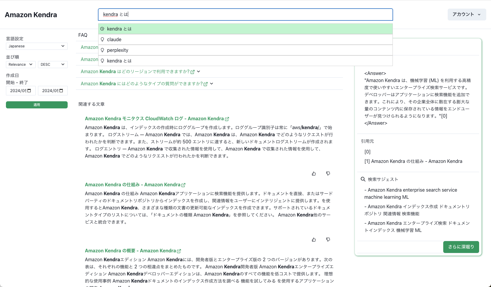
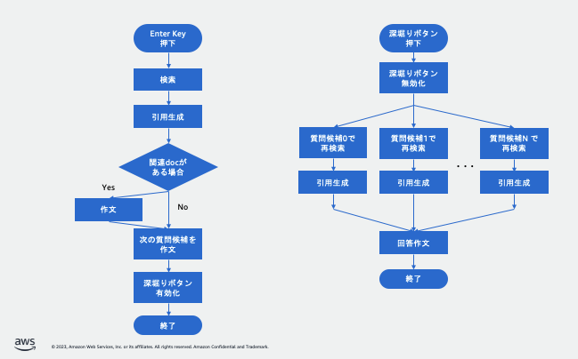

# JP RAG SAMPLE

> [!IMPORTANT]
> v0.4.0 より Amplify v1 から CDK に移行しました。以前のバージョンをお使いの方は[移行ガイド](docs/CDKMigration.md)をご覧ください。

**JP RAG SAMPLE は、企業の知識ベースを活用して検索クエリに対する的確な回答を生成するためのオープンソースプロジェクトです。**

従来の検索エンジンでは、キーワードの一致度合いでヒット結果を返すため、ユーザーの本当の意図に沿った回答を得ることが難しい場合がありました。本ソリューションでは、企業の最新のナレッジベースから関連情報を検索し、大規模言語モデル(LLM)に与えることで、ユーザーの検索意図に沿った自然な回答を生成します。

## 主な利用シーン

- **カスタマーサポート**: 製品マニュアルや既知の問題集から最新の情報を参照し、ユーザーの問い合わせに的確に回答
- **社内FAQ**: 社内ナレッジベースを活用し、社員の問い合わせに簡潔に回答
- **マーケティング&セールス**: 最新の製品カタログや営業資料を参照し、顧客の質問に最適な情報を提示

## 導入メリット

- 📘 **関連情報の参照**: 企業の知識ベースから関連情報を参照し、検索意図に沿った回答を生成
- 🔍 **自然な検索体験**: 最新のLLMと組み合わせることで、キーワード検索を超えた自然な検索体験を実現  
- 📈 **検索精度の向上**: LLMが関連情報を総合的に判断することで、従来の検索よりも的確な回答を導出

## 主な機能

### 1. フルマネージドな Retriever (Amazon Kendra)

本ソリューションの検索エンジン部分には、AWS の AI サービス **Amazon Kendra** を利用しています。Kendra は完全マネージド型のサービスで、事前学習済みの AI モデルが組み込まれており、関連度の高いドキュメントを取り出すことができます。

これまでは検索アプリケーションを運用する場合、データを取り込むコネクターの開発、全文データベースの運用、ベクトル生成用のアルゴリズム開発などが必要でした。一方 Amazon Kendra はフルマネージドサービスであるためそれらの開発・運用は不要です。Amazon Kendra には、Amazon Simple Storage Service (Amazon S3)、SharePoint、Confluence、ウェブサイトなどの一般的なデータソースへのコネクタがあらかじめ組み込まれており、HTML、Word、PowerPoint、PDF、Excel、テキストファイルなどの一般的なドキュメント形式もサポートしています。エンドユーザーの権限で許可されているドキュメントのみに基づいて応答をフィルタリングするために、アクセス制御リスト (ACL) にも対応しており、エンタープライズ企業での導入実績もあります。

### 2. 高度な生成 AI (Anthropic Claude 3 Haiku)

生成 AI 部分には、**Anthropic Claude 3 Haiku** を利用しています。Claude 3 Haikuは、高速な応答性と自然な対話を実現するよう設計された、コンパクトな大規模言語モデルです。

### 3. その他の特徴

- **フィルター検索**: ドキュメントの種類、作成日時などでフィルタリングが可能
- **Incremental Learning (英語のみ)**: 検索結果の良し悪しフィードバックを次回以降に反映
- **セキュリティ**: WAF、MFA、IP制限、メールドメイン制限、SAML連携などを実装
- **多言語対応**: 日本語を含め多言語に対応

## アーキテクチャ概要

本ソリューションは以下のようなアーキテクチャで構成されています。

## クイックスタート

ソリューションのデプロイ方法は[開発者ガイド](./docs/DeveloperGuide.md)を参照してください。

## Search Flow / 検索の流れ

検索の流れは以下のとおりです。

## コスト

ご利用いただく際の、構成と料金試算例が以下になります。従量課金制となっており、実際の料金はご利用内容により変動いたします。

|    サービス   |  項目     |  数量   |   単価   | 料金 (USD) |
| :------------|----------|--------- | --------|------------:|
| Amazon Kendra | Developer Edition | 730h | $1.125 / h |  810 |
| | Connector でスキャンしたドキュメント数 | 5,000 ドキュメント | 0.000001 USD/ドキュメント | 0.01 |
| | Connector でスキャンした時間 | 30 時間 | 0.35 USD/時間 | 10.50 |
| Amazon Bedrock  | Claud 3 Haiku 入力トークン | 11,000,000 トークン | 0.00025 USD/1000 トークン | 2.75 |
| | Claud 3 Haiku 出力トークン | 4,400,000 トークン | 0.00125 USD/1000 トークン | 5.5 |
| AWS Lambda | 割り当てたメモリと実行時間 | 37,500 GB-秒 | 0.000016667 USD/GB-秒あたり | 0.63 |
| | Lambda HTTP 応答ストリーム処理バイト | 1 GB | 0.008 USD/GB | 0.01  |
| Amazon API Gateway  | REST API リクエスト数 | 15,000 リクエスト | 4.25 USD/100 万リクエスト | 0.06 |
|Amazon S3 | ストレージ容量 | 0.01 GB | 0.025 USD/GB | 0 |
| | GET、SELECT リクエスト数 | 1,000 リクエスト | 0.00037 USD/1000 リクエスト | 0 |
| Amazon CloudFront | データ転送 (OUT) | 1 GB | 0.114 USD/時間 | 0.11 |
| |HTTPS リクエスト | 30,000 リクエスト | 0.012 USD/1万リクエスト | 0.04 |
| Amazon Cognito | アクティブユーザー数	| 50 ユーザー | $0.0055 /ユーザー    |  0.28  |
| 合計     |        |        |            |  829.89   |  

* 価格は執筆時点での内容になります。最新情報は [AWS 公式ウェブサイト](https://aws.amazon.com/)にてご確認ください。

## CONTRIBUTING

本プロジェクトへの質問や改善提案は、[GitHub Issues](https://github.com/aws-samples/jp-rag-sample/issues) よりお願いします。

詳細については [CONTRIBUTING](/CONTRIBUTING.md) もご確認ください。

## LICENSE

Copyright 2024 Amazon.com, Inc. or its affiliates. All Rights Reserved.
Licensed under the [MIT-0 License](https://github.com/aws/mit-0)
