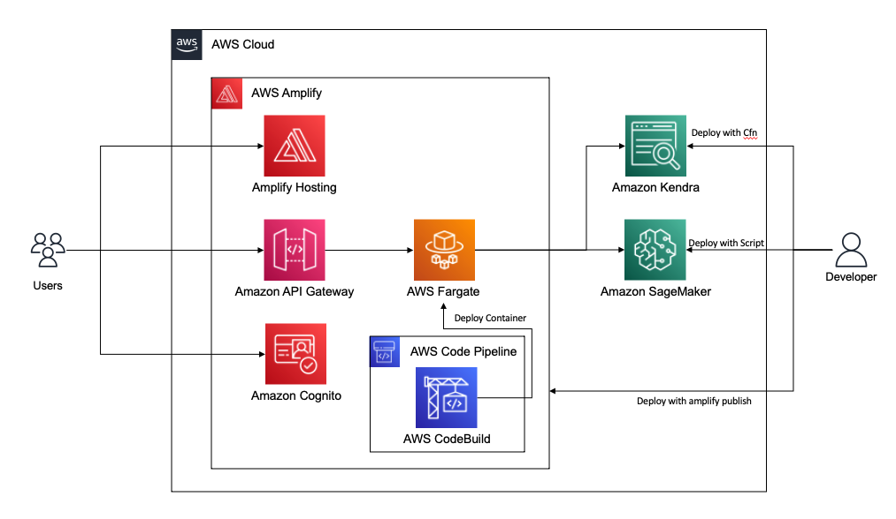

# JP RAG SOLUTION

このソリューションは AWS 上で Retrieval Augmented Generation (RAG) を構築するサンプルコードです。

このソリューションは以下のような構成になっています。

## デモ

https://xxxx.amplifyapp.com

## デプロイ/開発

[開発者ガイド](./docs/DeveloperGuide.md) をご参照ください。

## コスト

|               リソース             | 1月あたりのコスト ($USD) |
| --------------------------------- | ---------------------:|
| Kendra Index                      |  1008  |
| SageMaker Endpoint (g4dn.xlarge)  |  530   |
| Fargate (0.5 vCPU, 1 GB Memory)   |  18    |
| Amplify                           |  5     |
| 合計                               |  1561  |  

## LICENSE

MIT-0
